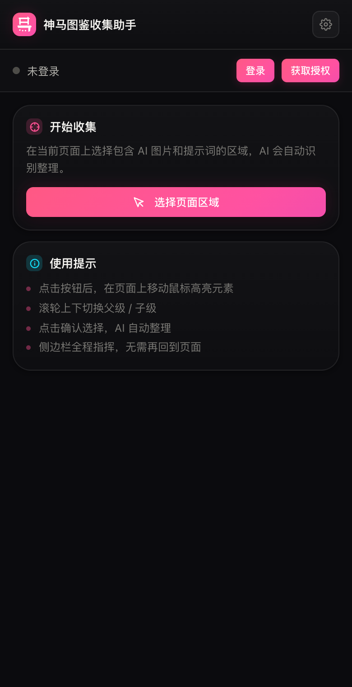
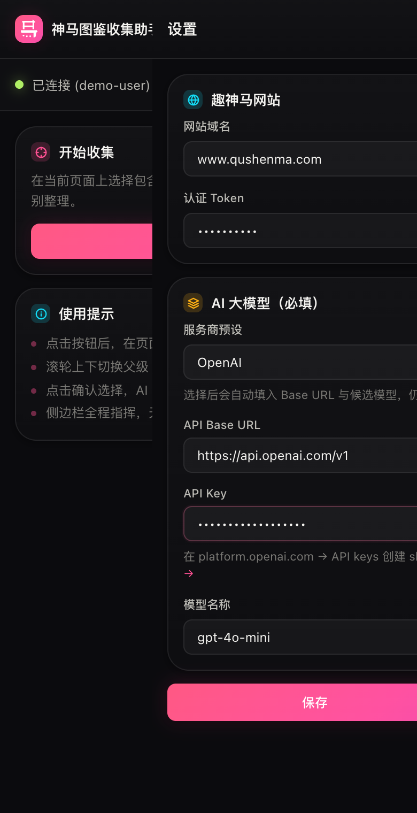
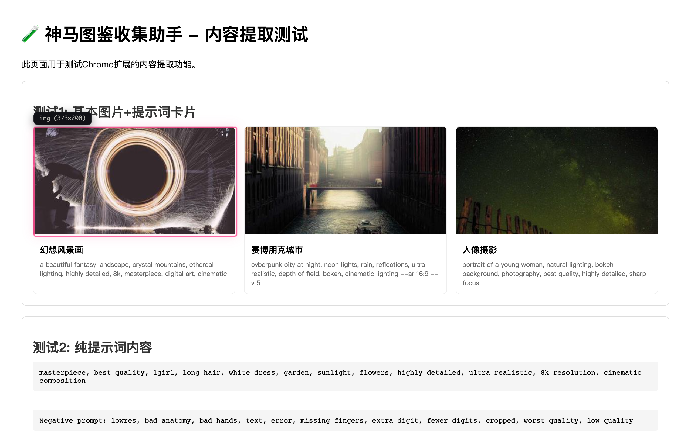
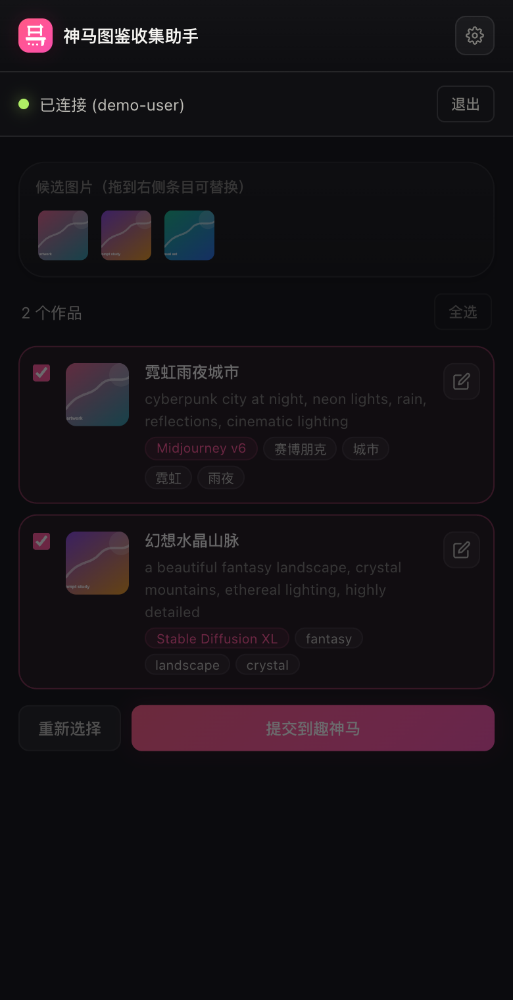
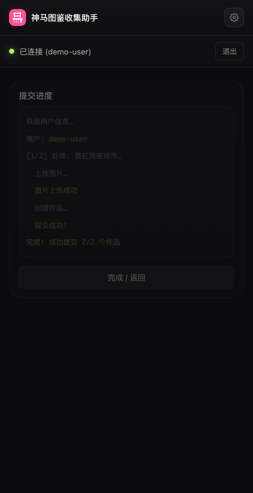

# 工作流程

这份流程面向公开仓库使用者：从安装扩展，到选择网页内容、AI 整理、人工校对，再提交到趣神马。

## 1. 安装扩展

1. 下载或克隆本仓库。
2. 打开 Chrome，进入 `chrome://extensions/`。
3. 开启右上角的「开发者模式」。
4. 点击「加载已解压的扩展程序」，选择仓库根目录。
5. 工具栏出现「神马图鉴收集助手」图标后，点击图标打开右侧边栏。



## 2. 配置授权和 AI

1. 点击右上角设置按钮。
2. 网站域名默认是 `www.qushenma.com`，也可以填本地或私有部署域名。
3. 登录趣神马后点击「获取授权」，或手动填入 Bearer Token。
4. 选择一个 OpenAI 兼容的大模型服务商，填入 Base URL、API Key 和模型名。
5. 点击「保存」，再点击「测试连接」确认网站授权可用。



## 3. 选择网页区域

1. 打开任意 AI 图片或提示词页面。
2. 在侧边栏点击「选择页面区域」。
3. 鼠标移动会高亮网页元素。
4. 滚轮向上/向下切换父级或子级元素。
5. 点击确认，或按 `Esc` 取消。



## 4. 校对 AI 整理结果

扩展会把选中区域交给配置的大模型，整理为作品列表。提交前建议逐条检查：

1. 勾选要提交的作品。
2. 检查图片、标题、提示词、模型、标签和摘要。
3. 从候选图片池拖拽图片到作品条目，可替换图片。
4. 点击编辑按钮可以修改完整字段。



## 5. 提交到趣神马

确认无误后点击「提交到趣神马」。扩展会依次：

1. 获取当前登录用户。
2. 下载原网页图片。
3. 上传图片到趣神马媒体接口。
4. 创建作品。
5. 发布作品。
6. 在提交日志里显示每条结果。



## 日常开发

```bash
npm install
npm test
npm run screenshots
```

扩展没有打包步骤，修改源码后在 `chrome://extensions/` 点击刷新扩展即可。
如果截图脚本提示找不到浏览器，先运行 `npx playwright install chromium`。
